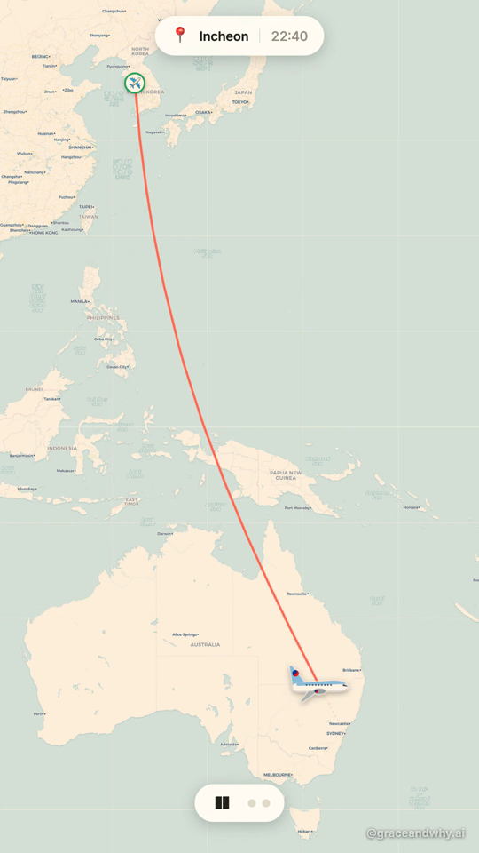
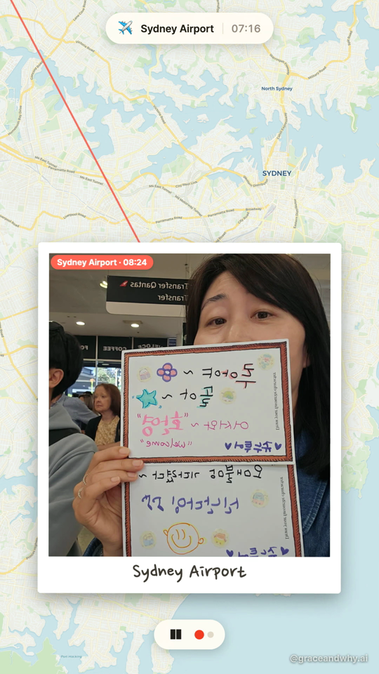
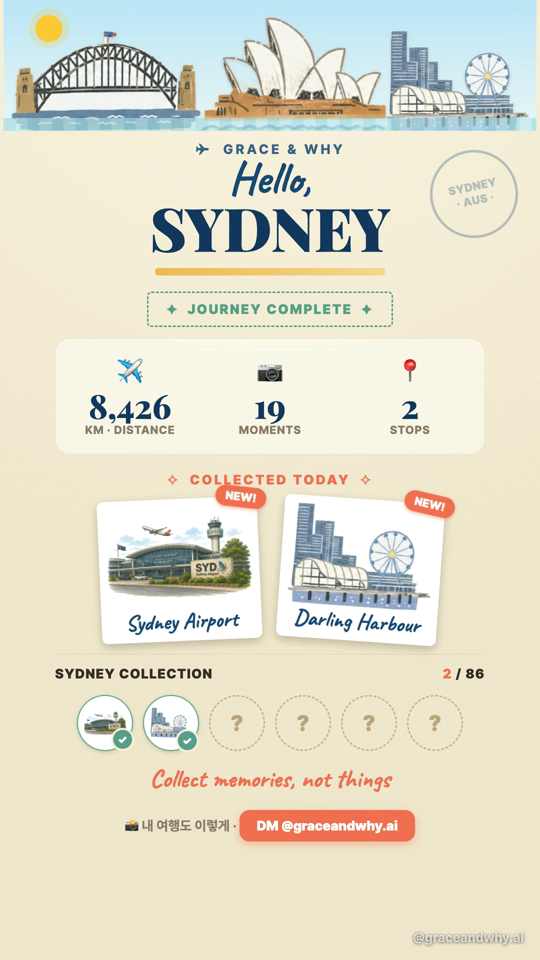
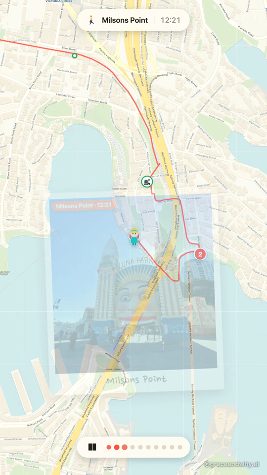
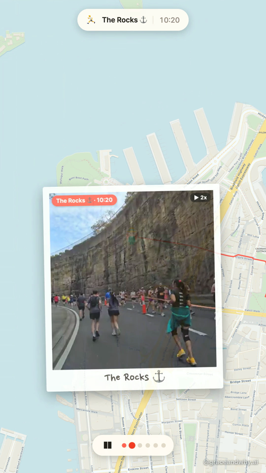
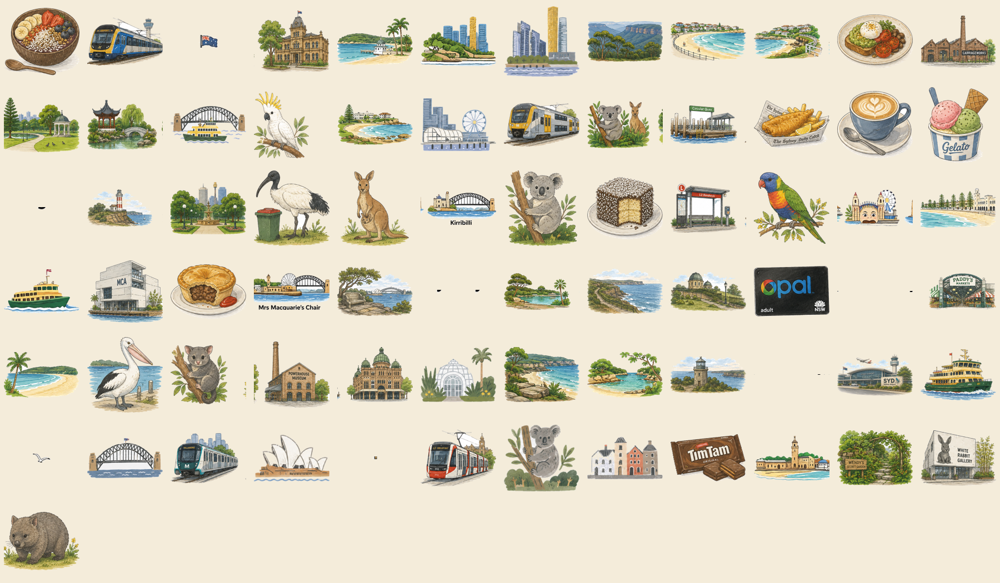

# 하루 여행기 · Stroll — Mobile App PRD
**Turn a day of photos into a map‑animated travel reel worth sharing — and collecting.**
**하루치 사진을, 지도 위에 살아 움직이는 — 그리고 모으고 싶은 — 여행 릴스로.**

> Working name 가제: **Stroll** (KR *하루 여행기*) · Product of **Grace & Why**
> Status: POC validated on 7 real days · this doc = the spec to take it to iOS/Android
> 상태: 실제 7개 데이터셋으로 POC 검증 완료 · 이 문서 = iOS/Android 앱화를 위한 기획서
> Version 0.1 · 2026‑06‑26 · Author: Grace & Why

---

## 0. Executive Summary · 한눈에

**EN —** Phone camera rolls are full of trips nobody re‑opens. Existing auto‑movies (Google Photos, Relive, Polarsteps) are either generic or sport‑only. **Stroll** takes a day's GPS‑tagged photos/videos and auto‑builds a 9:16 reel where the day's route *animates on a map*, a *polaroid* pops at each stop, and it closes on a **"Journey Card"** that turns each visited place into a **collectible sticker** ("2 / 86 collected"). Three things at once — **minimal input → trip‑type mood → share‑worthy finish** — plus a **collection mechanic** that pulls people back. Validated as a working pipeline on 7 different days (city walk, 10K run, gallery day, beach drive, an international Incheon→Sydney flight). This PRD scopes the move from a desktop POC to a real mobile app + cloud render, with benefits, product/service roadmap, and pricing.

**KR —** 사람들의 카메라 롤엔 다시 안 여는 여행 사진이 가득하다. 기존 자동 영상(구글 포토·Relive·Polarsteps)은 너무 일반적이거나 운동 전용이다. **Stroll**은 하루치 GPS 사진·영상을 넣으면 **지도 위에 그날 동선이 애니메이션**되고, 정류장마다 **폴라로이드**가 뜨며, 마지막에 들른 곳이 **수집 스티커**가 되는 **"여행 카드(Journey Card)"**("2 / 86 수집")로 마무리되는 9:16 릴스를 자동으로 만든다. **① 최소 입력 → ② 종류에 맞는 분위기 → ③ 공유하고 싶은 완성도**를 동시에 주고, 여기에 **수집(컬렉션) 동기**까지 얹는다. 도심 산책·러닝·전시·해변 드라이브·인천→시드니 국제선 비행까지 **실제 7개 데이터셋으로 검증된** 파이프라인이다. 이 PRD는 데스크톱 POC를 실제 모바일 앱 + 클라우드 렌더로 옮기기 위한 범위·베네핏·로드맵·프라이싱을 다룬다.

---

## 1. Vision · 비전

- **EN:** *"Don't organize your memories — collect them."* A travel journal that builds itself from the photos you already took, polished enough to post, gamified enough to keep playing.
- **KR:** *"추억을 정리하지 말고, 모으세요."* 이미 찍어둔 사진으로 스스로 완성되는 여행기. 올릴 만큼 예쁘고, 계속하고 싶을 만큼 재미있게.

**One‑liner · 한 줄 정의**
GPS‑tagged media for one day → a 9:16 map‑animated reel + a collectible Journey Card. Zero manual editing.
하루치 GPS 미디어 → 지도 애니메이션 9:16 릴스 + 수집형 여행 카드. 수동 편집 0.

---

## 2. Problem & Insight · 문제와 인사이트

**The problem · 문제**
1. **Camera‑roll graveyard · 사진첩 무덤** — Trips are documented but never revisited; organizing/editing is a chore. 여행은 찍히지만 다시 안 보고, 정리·편집은 귀찮다.
2. **Generic auto‑movies · 천편일률 자동영상** — Default tools (Google Photos memories) all look the same; a city day and a beach day feel identical. 기본 도구는 다 비슷하게 생겼다 — 도심 하루와 해변 하루가 똑같이 나온다.
3. **Sport‑only map tools · 운동 전용** — Relive/Strava animate a *route* but only for runs/rides, and stop there. Relive·Strava는 동선을 그리지만 운동에만, 거기서 끝난다.

**The insights that change the product · 제품을 바꾼 인사이트**
- **"내가 포함될 때 임팩트가 다르다" (a UX expert, after seeing the POC)** — A map of a day you *were in* hits differently than a generic montage. The reel's emotional payload = *your* route + *your* faces + *your* moments, woven together.
  → 내가 들어간 하루의 지도는 일반 몽타주와 차원이 다르게 와닿는다. 감정의 무게 = *내* 동선 + *내* 얼굴 + *내* 순간.
- **Curating is the real pain, not editing · 진짜 페인은 편집이 아니라 큐레이션** — People won't tidy 200 photos. Auto‑selecting the *good* shots (drop blur/dupes/signage) is itself the core value, not a nice‑to‑have. 200장을 정리할 사람은 없다 — 좋은 컷 자동 선별이 핵심 가치.
- **Collecting beats archiving · 보관보다 수집** — Turning visited places into a "X / 86" sticker collection (Pokédex‑style) converts a one‑off output into a *reason to come back and go further*. 들른 곳을 "X / 86" 스티커로 모으게 하면, 일회성 결과물이 *다시 와서 더 가고 싶은 이유*가 된다.

---

## 3. Solution & Value · 솔루션과 가치 (3 axes · 3축)

| Axis 축 | EN | KR |
|---|---|---|
| **① Minimal input** 최소 입력 | Drop a day's media (+1‑line note). GPS/EXIF gives the skeleton; the user gives meaning. | 하루치 미디어(+1줄 메모)만. GPS·EXIF가 뼈대를, 사용자가 의미를 준다. |
| **② Trip‑type mood** 분위기 적합도 | A city walk, a race, a gallery day, a beach drive, an overseas flight each *feel* different (theme presets: pacing, palette, marker set, copy tone). | 도심·러닝·전시·해변·해외가 각기 다른 무드(테마 프리셋: 페이싱·팔레트·마커·카피 톤). |
| **③ Share‑worthy finish** 공유 완성도 | 1080p, opening hook, kinetic chips, polaroids, stats, stamp animation, watermark, CTA = production value, not a slideshow. | 1080p·오프닝 훅·키네틱 칩·폴라로이드·통계·스탬프 모션·워터마크·CTA = "그냥 슬라이드쇼"와 다른 프로덕션 밸류. |
| **④ Collection hook** 수집 동기 *(new)* | Each place = a collectible illustrated sticker; "X / 86 collected" + locked slots = retention + re‑use. | 들른 곳 = 일러스트 수집 스티커; "X / 86 수집" + 잠긴 칸 = 리텐션·재사용. |

---

## 4. The Moat · 해자

> **It's not the map (Google has maps).** The defensible thing is delivering **minimal input → trip‑type mood → share‑worthy finish → a collection you want to complete**, *all at once*, in a **signature visual language** (the Sydney Icon Pack) that extends city‑by‑city.
> **지도가 아니다(구글도 지도는 한다).** 방어 가능한 것은 **최소 입력 → 종류별 무드 → 공유 완성도 → 모으고 싶은 컬렉션**을 *동시에*, 도시별로 확장되는 **시그니처 비주얼 언어**(Sydney Icon Pack)로 주는 것.

- **Signature asset · 시그니처 자산:** a consistent illustrated icon system (73 Sydney icons built; target ~86 → Melbourne/Tokyo/Seoul/NYC). Reusable across map markers, the outro collection, gifting, merch.
- **Mode engine · 모드 엔진:** 7 transport modes (walk/run/tram/train/ferry/car/flight) each = marker + real route geometry + label; new modes are cheap to add.
- **Data‑driven, not hard‑coded · 데이터 주도:** every day = a `brief.json` of *meaning*; the engine never changes per trip → scales to any city/trip type.

---

## 5. Key Features (with POC) · 핵심 기능 (POC 포함)

### 5.1 Animated map journey + 7 transport modes · 지도 동선 애니메이션 + 7종 이동수단
The day's route draws on the map; a mode‑specific marker travels it. Car snaps to roads, train/tram to real transit lines, **flight to a great‑circle arc** with a Korean‑Air plane crossing two continents in one frame.
그날 동선이 지도에 그려지고 모드별 마커가 이동. 차=도로 스냅, 기차/트램=실제 노선, **비행=대권 곡선**으로 대한항공기가 두 대륙을 한 화면에서 횡단.



### 5.2 Polaroid stops on the map · 지도 위 폴라로이드 정류장
At each stop the marker becomes a person; curated photos/videos pop as polaroids with the place name. Landmark **illustration stickers** appear pinned on the map ("collect a sticker when you visit").
정류장마다 마커가 사람으로 바뀌고, 큐레이션된 사진·영상이 지명과 함께 폴라로이드로 팝업. 랜드마크 **일러스트 스티커**가 지도에 핀처럼 등장("방문하면 스티커 획득").



### 5.3 Journey Card outro + sticker collection · 여행 카드 아웃트로 + 스티커 컬렉션
Closes on a vintage **travel‑journal card**: city skyline banner, stats (distance/moments/stops), **"COLLECTED TODAY"** stamps that *thunk* down passport‑style, and a **"SYDNEY COLLECTION 2 / 86"** grid with locked slots — the gamification engine.
빈티지 **여행기 카드**로 마무리: 도시 스카이라인 배너, 통계(거리·순간·정류장), 여권처럼 *쾅* 찍히는 **"COLLECTED TODAY"** 스탬프, 잠긴 칸이 있는 **"SYDNEY COLLECTION 2 / 86"** 그리드 = 게이미피케이션 엔진.



### 5.4 Trip‑type themes · 여행 종류별 테마
One line (`theme: city|run|nature|overseas`) sets pacing, palette, marker set, copy tone. Same engine → a harbour stroll, a 10K race recap, and an overseas trip look *nothing alike*.
한 줄(`theme`)이 페이싱·팔레트·마커·카피를 깐다. 같은 엔진으로 하버 산책 / 10K 러닝 회고 / 해외여행이 전혀 다르게.

 

### 5.5 Auto‑curation (vision triage) · 자동 큐레이션 (비전 선별)
Reads the camera roll and keeps the *best* per stop (drop blur/dupes/signage/screenshots), infers transport mode (Opal reader, platform, vehicle in‑frame), picks a hero shot, drafts captions. **This is the core value, not polish** — it makes the ideal input "dump the day + 1 line."
사진첩을 읽어 정류장별 베스트만 남기고(흐림·중복·안내판·스샷 제외), 이동수단 추정(Opal 단말·플랫폼·차량), 히어로 컷 선택, 캡션 초안. **이게 핵심 가치** — 이상적 입력을 "하루 다 넣고 1줄"로 만든다.

### 5.6 Signature Icon Pack → multi‑city · 시그니처 아이콘 팩 → 멀티시티
73 hand‑style Sydney icons (beaches, landmarks, transit, food, wildlife). Same design language extends to Melbourne / Tokyo / Seoul / NYC — the collectible spine of the whole product.
73개 수채화풍 시드니 아이콘(해변·랜드마크·교통·음식·동물). 같은 디자인 언어로 멜번/도쿄/서울/뉴욕 확장 — 제품 전체의 수집 축.



---

## 6. POC Evidence · 검증된 POC

**Proven on 7 real days · 실제 7개 데이터셋으로 검증** (same engine, no per‑trip code):

| Dataset 데이터셋 | Type 성격 | What it proved 검증한 것 |
|---|---|---|
| Sydney Harbour Day | City walk (walk·train·ferry) | Route snapping, real ferry/rail lines, reel export, hook/CTA |
| Hoka 10K | Running event | Theme=run, mode‑misclassification fix via brief, pacing rules |
| OneFineDay | Gallery day (MCA→tram→Fish Mkt) | Vision‑authored brief, new tram mode, mode auto‑detect |
| SummerChristmas | Beach drive | Car mode, road‑snap, pin‑media (meal/shark), feature pacing |
| KendoDay | Single‑venue day | Sourceless "home→venue" start waypoint, train leg |
| RunDay | Scenic run | Full‑play video dwell, recorder race‑condition fix |
| **WelcomeToSydney** | **International flight** | **Flight mode (arc + KAL plane + intercontinental camera), Journey‑Card outro, sticker collection, map markers** |

**Already working end‑to‑end:** GPS→clustering→geocode→mode→route‑snap→video‑clip→render→1080×1920 mp4. The aesthetic (Journey Card, stamp animation, icon collection) is built and validated, and **a UX expert reviewed it unprompted as "different / 임팩트가 다르다."**
**이미 엔드투엔드로 작동:** GPS→클러스터링→지오코딩→모드→경로스냅→영상클립→렌더→1080×1920 mp4. 미적 완성도(여행 카드·스탬프·아이콘 컬렉션)도 구현·검증됐고, **UX 전문가가 먼저 "다르다"고 평가**했다.

---

## 7. User Benefits · 사용자 베네핏

- **EN — Zero effort, finished output.** Hand it the day; get a post‑ready reel. No timeline, no manual selection.
  **KR — 노력 0, 완성품.** 하루를 건네면 올릴 수 있는 릴스가 나온다. 타임라인·수동 선택 없음.
- **EN — It feels like *your* day.** Real route + real faces + real places, not a template.
  **KR — *내* 하루처럼 느껴진다.** 진짜 동선·얼굴·장소, 템플릿이 아니라.
- **EN — Pride to share.** Production value that earns saves/shares (the hardest currency).
  **KR — 자랑하고 싶은 완성도.** 저장·공유를 부르는 프로덕션 밸류.
- **EN — A reason to keep going.** "37 / 86 collected" turns travel into a personal map you fill in.
  **KR — 계속할 이유.** "37 / 86 수집"이 여행을 채워가는 나만의 지도로 만든다.
- **EN — A gift, not a chore.** Hand someone a finished memory with a ribbon on it ("함께한 추억을 선물하세요").
  **KR — 숙제가 아니라 선물.** 완성된 추억에 리본 달아 건네기.

---

## 8. Product → Service Evolution · 제품·서비스 발전 방향

1. **Consumer app (core)** — the auto‑reel + collection, per‑city packs. 소비자 앱(코어).
2. **Gifting · 선물하기** — "create & send a finished memory reel" for someone you traveled with; print/postcard/sticker‑sheet add‑ons (the icon pack monetizes physically). 함께 간 사람에게 완성 릴스 선물 + 엽서/스티커 굿즈.
3. **Multi‑city collections · 멀티시티 컬렉션** — Sydney → Melbourne/Tokyo/Seoul/NYC; seasonal packs (spring/winter/night). 도시·시즌 팩 = 지속 콘텐츠.
4. **Creator / B2B · 크리에이터·B2B** — branded map reels for tourism boards, hotels, tour operators, cafes, clinics ("how to get to us / a day in our neighbourhood"). Ties into the existing **Grace & Why** 1‑person‑agency model (retainer / per‑project). 관광청·호텔·투어·카페·클리닉용 브랜디드 맵 릴스 → 기존 Grace & Why 에이전시 모델과 연결.
5. **Render API / white‑label · API·화이트라벨** — sell the render engine to travel apps (Wanderlog, booking platforms). 여행앱에 렌더 엔진 제공.

---

## 9. Technical Architecture (for the app) · 기술 아키텍처 (앱화)

**POC today (desktop) · 현재 POC(데스크톱):** Python (`build_stroll.py`: clustering, geocode, Google Directions, ffmpeg clips) → web render (Leaflet/Carto + JS animation) → headless Chrome (puppeteer screencast) → ffmpeg → mp4.

**App target (mobile + cloud) · 앱 목표(모바일 + 클라우드):**
```
[ Mobile app  RN/Flutter ]                 [ Cloud backend ]
 pick day's media                            ingest + EXIF/GPS
 on-device pre-cull (blur/dupes, fast)  →    cluster · geocode · mode-infer
 1-line brief / theme pick                   route-snap (Directions/OSRM)
 preview (lightweight) · share          ←    vision triage (curation/captions)
                                             RENDER (headless web→mp4) on GPU/CPU
                                             store mp4 + collection state
```
**Key shift · 핵심 전환:** the heavy render is a **cloud service**, not on‑device (headless‑Chrome capture needs a server). The mobile app = capture, curate UI, theme/brief, preview, share, and the **collection profile**.
무거운 렌더는 온디바이스가 아니라 **클라우드 서비스**(헤드리스 캡처는 서버 필요). 모바일 앱 = 촬영물 선택·큐레이션 UI·테마·미리보기·공유·**컬렉션 프로필**.

**Cost drivers (marginal cost per reel) · 한계비용 요소:**
| Item | Note | Lever 절감 레버 |
|---|---|---|
| Map tiles 지도 타일 | Carto free tier → self‑host at scale | MapTiler / self‑host |
| Routing 경로 | Google Directions ($) → **OSRM/Valhalla free** | already have fallback |
| Vision 비전 | per‑photo inference | **local Ollama / Gemini Flash free tier** → ~$0 |
| Render compute 렌더 | headless browser + ffmpeg, ~30–60s/reel | batch, cache, autoscale |
| Storage/egress 저장·대역폭 | user video in + mp4 out = the **biggest** scaling cost | tiered retention, paywall heavy use |
> Most pieces run keyless/local → **low marginal cost**; the real scaling cost is **render compute + media bandwidth**, so unlimited‑free is risky. 대부분 무료/로컬화 가능 → 한계비용 낮음; 진짜 비용은 **렌더 컴퓨트 + 미디어 대역폭** → 무제한 무료는 위험.

---

## 10. MVP Scope & Roadmap · MVP 범위·로드맵

**MVP (v0.1) — one city (Sydney), 4 themes, the loop · 한 도시·4테마·핵심 루프**
- Import a day → auto‑cull → pick theme → cloud render → Journey Card with collection → save/share.
- Modes: walk/train/ferry/car (+flight if origin abroad). Icon pack: Sydney 86.
- Goal: prove retention via the collection (do users come back to fill the map?).

**v1 — Music beat‑sync, multi‑aspect export (9:16/1:1/cover), gifting, 2nd city.**
**v2 — Auto vision‑brief (zero text input), seasonal packs, creator/B2B portal, render API.**

| Phase | Ships 출시 | Validates 검증 |
|---|---|---|
| MVP | Core loop, Sydney, collection | Retention + share rate |
| v1 | Music, gifting, Melbourne | Willingness to pay + virality |
| v2 | Auto‑brief, B2B, API | Margin + new revenue lines |

---

## 11. Business Model & Pricing · 비즈니스 모델·프라이싱

> Honest stance: **as a standalone consumer SaaS this is a red ocean** (Google Photos free default + funded incumbents Relive/Polarsteps). The wedge = **trip‑type mood + collection + signature aesthetic + KR market + gifting + B2B.** Treat consumer as the funnel; make money on **subscription power‑users, gifting, and B2B.**
> 솔직히: **소비자 단독 SaaS는 레드오션**(구글 포토 무료 기본 + 펀딩 인큐번트). 쐐기 = 종류별 무드 + 수집 + 시그니처 미감 + 한국시장 + 선물 + B2B. 소비자는 깔때기로, 돈은 구독·선물·B2B에서.

**A. Consumer freemium · 소비자 프리미엄**
| Tier | Price (guide) | Includes |
|---|---|---|
| Free | $0 | 1–2 reels/mo, watermark, SD, base theme, public collection |
| **Pro** | **$5–8/mo** or **$39/yr** | HD, no watermark, all themes + music, multi‑aspect export, full collection, priority render |
| Credits | $1–2 / extra reel | pay‑as‑you‑go for free users |
*Convert ~1–3% of actives; Pro mainly funds itself + funnels.* 활성의 1~3% 전환 가정; Pro는 자급+깔때기.

**B. Gifting · 선물 (one‑off, high‑intent)**
- **$6–12** to generate & send a finished memory reel to a travel companion; **+$ physical** (postcard, sticker sheet of the city pack, mini photo‑book). 동행에게 완성 릴스 선물 + 굿즈 애드온.

**C. City / season packs · 도시·시즌 팩**
- **$2–4** per extra city icon collection or seasonal theme bundle. 추가 도시·시즌 번들.

**D. B2B / Creator (the real revenue) · B2B (실매출)**
- **Per‑project** branded map reel **$150–400**, or **monthly retainer $500–2,000** (content set/mo) — reuses Grace & Why retainer model.
- **Render API / white‑label**: per‑render or seat pricing for travel platforms. 건당/리테이너 + API.

**Why it can work financially · 재무적 근거:** marginal cost per reel is cents‑to‑low‑$ if routing/vision/tiles run free/local; the dominant cost is render+bandwidth, so pricing gates heavy/HD/B2B use while free stays SD/watermarked. 라우팅·비전·타일을 무료/로컬화하면 한계비용이 매우 낮음 → HD·대량·B2B는 과금, 무료는 SD·워터마크로 비용 차단.

---

## 12. Go‑to‑Market · 시장 진입

- **Build‑in‑public on @graceandwhy.ai** — post the reels themselves as content (each reel markets the product); watch saves/shares/"make me one" DMs as the demand signal. 릴스 자체가 콘텐츠이자 광고; 저장·DM이 수요 신호.
- **KR‑first wedge** — Korean travelers to Australia/abroad, KakaoTalk/IG sharing behavior, gifting culture. 한국 해외여행자 + 카톡/인스타 공유 + 선물 문화.
- **Gifting loop** — every gifted reel is an invite to a non‑user. 선물 = 비사용자 초대.
- **B2B demo‑first** — branded sample reel → proposal (mirrors the proven Grace & Why outreach). 브랜디드 데모 → 제안.

---

## 13. Competitive Landscape & Risks · 경쟁·리스크

> **Full analysis → [`competitive-analysis.md`](competitive-analysis.md).** Two findings reshape positioning. 전체 분석은 딥다이브 문서 참고 — 두 발견이 포지셔닝을 바꾼다.

| Competitor | Reality (researched) | Our wedge vs them |
|---|---|---|
| **Polarsteps** ⚠️ #1 threat | 5M+ users; **already ships "Trip Reels" (2025)** = auto map‑animated reel, one button. Free; monetizes print books €36–150. | Out‑aesthetic (trip‑type mood, polaroid/Journey‑Card), **in‑reel collection**, richer modes (flight arc), KR‑first, gifting. *iOS‑only map scenes, generic look, no collection.* |
| Relive / Strava | sport‑only 3D flyover; Plus ~$12–20/mo | Any trip type, cheaper, stops+collection+warmer aesthetic |
| **Stamp apps** (Been·PASSPRT·Stamps) | own "collect a place" — **collection is NOT novel**; but it's a *static passport*, not a reel | Collection **earned inside a share‑worthy day reel**, not a checkbox map |
| Google / Apple Photos | free default auto‑movie (cinematic, AI prompt) | no map/route/mood/collection — generic montage |
| 디로그(KR) / 포토로그 / 어디 | KR AI‑diary + map logs | none make a *postable mood reel + collection* → own that KR gap |

**Re‑framed wedge · 재정의된 쐐기:** not "collection" alone, but **the first to FUSE** {auto map reel · in‑reel collectible · trip‑type aesthetic · transport storytelling · KR + gifting}. No competitor lights up all five.

**Risks · 리스크:** (1) **Polarsteps closes the gap** — they iterate reels; speed + aesthetic/collection lead is strategic (assume 6–12mo window). (2) consumer WTP low → gifting/B2B. (3) render+bandwidth cost at scale → tiering/caps. (4) vision‑curation quality = make‑or‑break → invest. (5) per‑city icon art = ongoing cost → systematize (slicer pipeline already does).

---

## 14. Success Metrics · 성공 지표

- **Activation 활성화:** % who finish a reel on first session.
- **Share rate 공유율:** reels shared / created (the core viral metric).
- **Collection retention 컬렉션 리텐션:** D7/D30 return to add a place ("X/86" climbing).
- **Gift conversion 선물 전환:** % who send a reel to someone.
- **Pro/B2B revenue 매출:** MRR + per‑project.

---

## 15. Open Questions · 열린 질문

- On‑device vs cloud pre‑cull split (privacy vs. speed)? 온디바이스 vs 클라우드 선별 경계?
- Final product name (Stroll is taken in places). 최종 제품명.
- Icon‑pack scaling — commission vs. generate per city? 도시별 아이콘 제작 방식.
- Music licensing (in‑app library vs. "add in Instagram"). 음악 라이선스.
- Privacy/GPS handling + data retention policy. 위치·데이터 보존 정책.

---

## Appendix · 부록

**A. Engine internals (proven) · 엔진 내부:** `brief.json` data‑driven; 7 modes = marker SVG + route geometry + label; per‑mode camera (flight = `flyToBounds(arc)` + no‑pan); `waitTiles()` for clean headless capture; theme presets (`THEMES`); pin‑media, feature‑pacing, collapse‑dupes, start‑waypoint; Sydney Icon Pack via `slice_iconset.py`.

**B. Stack · 스택:** Python · Leaflet/Carto · Google Directions (↔ OSRM/Valhalla free) · Nominatim · rembg (local cutout) · puppeteer‑core + ffmpeg. Vision triage backend pluggable (Claude / local Ollama / Gemini).

**C. Reference · 참고:** internal `stroll/PLANNING.md` (learnings log), Grace & Why brand & agency model (business‑direction), the friend's "함께한 추억을 선물하세요" app concept (gifting axis).

---

*This is a living document. POC screenshots in `docs/poc/` are real outputs from the validated engine.*
*살아있는 문서. `docs/poc/`의 스샷은 검증된 엔진의 실제 출력물.*
